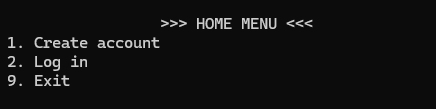
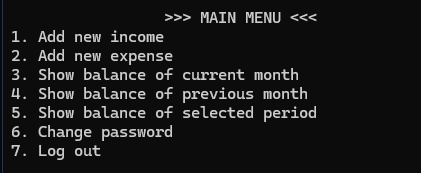
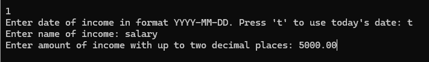
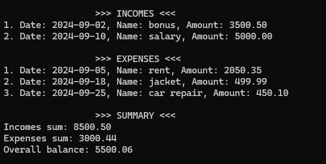

# Personal Budget OPP

## About

I present the final version of the PersonalBudget application. It has been written in C++ using the 
object-oriented programming paradigm. The purpose of the application is to manage personal finances 
by tracking incomes and expenses. This program was created while learning c++ programming 
as part of the PrzyszłyProgramista project.

## Application

After launching the program, the application allows you to register a new user, log in an existing user 
or exit the program.

A logged-in user can add a new income or expense. He also can check the balance for the current month, 
the previous month, or any period specified by the user. Changing the password and the logout are the last 
two options in the menu.

When adding a new income or expense, the user is asked to specify the date of the transaction. 
The user can select today’s date or specify any other date in the format YYYY-MM-DD. Next, the user 
is asked to provide the name of the income/expense and the value of the transaction.  

Below there is a snippet of the program showing the balance for the current month. The summary includes 
a list of incomes and expenses sorted from oldest to newest. After that at the bottom there is 
a total summary of incomes and expenses for the specified period, as well as the overall balance.

## How does it work?

All data related to users, income, and expenses are stored in XML files using the CMarkup library.
The program also utilizes operations on dates, vectors, maps, pointers, and libraries (e.g. vector, ctime, 
sstream, iomanip, algorithm). The source code is created based on the principles of clean code.

## Special thanks

* https://przyszlyprogramista.pl/

